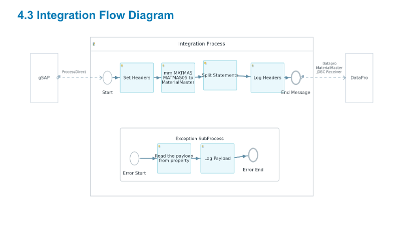
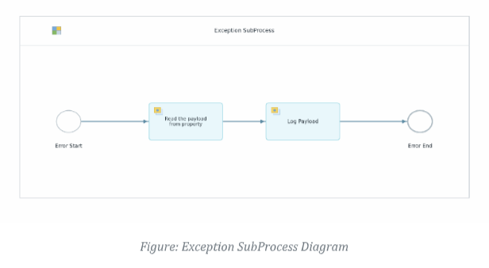
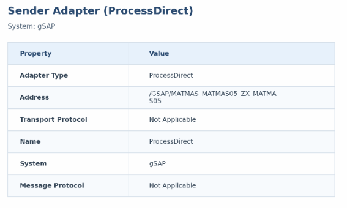
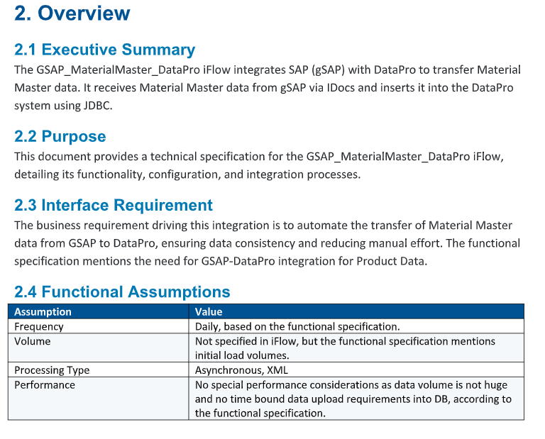

# SAP CI Technical Specification Generator

<p align="center">
  <strong>Turn SAP Cloud Integration projects into review-ready technical specifications.</strong><br />
  Parse iFlows, resolve externalized parameters, generate diagrams, and compose structured Word documents from ZIP files or extracted project folders.
</p>

<p align="center">
  <a href="https://github.com/kg290/SAP-CI-Technical-Specification-Generator"></a>
  
  
  
</p>

## What it does

SAP Cloud Integration projects contain the information needed for a technical specification, but that information is spread across BPMN/XML process definitions, adapter properties, mappings, scripts, WSDLs, XSDs, parameter files, and metadata.

This generator turns those artifacts into a consistent documentation package:

```text
SAP CI project ZIP / folder
          │
          ▼
   Artifact extraction
          │
          ▼
   iFlow + parameter parsing
          │
          ├── Optional Gemini narrative generation
          ├── Deterministic fallback summaries
          └── Page-safe diagram rendering
          │
          ▼
Technical Specification .docx + standalone .png diagrams
```

## Why it exists

| Documentation problem | Generator response |
| --- | --- |
| iFlow details are distributed across many files | Extracts and correlates BPMN/XML, properties, scripts, mappings, WSDLs, and XSDs |
| Technical documents vary by author | Produces repeatable sections, tables, headings, diagrams, and appendices |
| Externalized parameters are difficult to trace | Resolves available values and records parameter usage |
| Exception flows are easy to miss | Detects exception subprocesses across main and local processes |
| Large diagrams break Word page layouts | Scales and splits diagrams to avoid cropped visuals and stranded headings |
| AI generation can be unavailable or rate-limited | Continues with deterministic fallback content |

## Output package

For each input iFlow, the generator can produce:

| Output | Description |
| --- | --- |
| `<iflow>_TechSpec.docx` | Formatted technical specification document |
| `<iflow>_integration_flow.png` | Main integration flow diagram |
| `<iflow>_sender.png` | Sender adapter diagram |
| `<iflow>_receiver.png` | Receiver adapter diagram |
| Local process diagrams | Generated when local integration processes exist |
| Exception subprocess diagrams | Generated for detected exception flows |

The document can contain:

- Executive overview, purpose, scope, and assumptions
- Interface and message-flow description
- Main integration process with ordered steps
- Sender and receiver adapter tables
- Mapping and transformation summaries
- Groovy and script sections
- Local integration process documentation
- Exception subprocess documentation with diagrams and summary tables
- Externalized parameter tables and usage references
- Metadata, appendix, and generated-artifact context

## Documentation gallery

The generator is designed to produce documentation that is useful in design reviews, handovers, support investigations, and implementation sign-off.

<table>
  <tr>
    <td align="center"><strong>Generated integration flow</strong></td>
    <td align="center"><strong>Exception subprocess</strong></td>
  </tr>
  <tr>
    <td></td>
    <td></td>
  </tr>
  <tr>
    <td align="center"><strong>Sender adapter specification</strong></td>
    <td align="center"><strong>Technical overview section</strong></td>
  </tr>
  <tr>
    <td></td>
    <td></td>
  </tr>
</table>

## Core capabilities

### iFlow artifact intelligence

- Accepts ZIP archives and extracted SAP integration project folders
- Locates `.iflw` files inside standard scenario-flow paths
- Extracts processes, sequence flows, message flows, metadata, and adapter properties
- Reads mapping, script, WSDL, XSD, and parameter artifacts when present
- Handles multiple sample projects under a shared output root

### Parameter and configuration resolution

- Resolves placeholders such as `{{Address}}` and `${Credential}` when values are available
- Connects externalized values with their usage locations
- Removes noisy internal property rows from generated documents
- Avoids flooding the document with oversized namespace/XML blocks

### Diagram generation

- Main integration flow diagrams
- Dedicated sender and receiver diagrams
- Local integration process diagrams
- Exception subprocess diagrams
- Page-safe integration-flow placement for Word output
- Standalone PNG exports for review and reuse

### AI-assisted, deterministic output

- Optional Gemini-powered narrative sections
- Configurable model and prompt scope
- Cached AI runs when enabled
- Deterministic fallback content when AI is unavailable, rate-limited, or not configured
- Structured technical values remain derived from parsed source artifacts

## Architecture

```text
┌──────────────────────────────────────────────────────────────┐
│                         CLI / main.py                        │
│  interactive · run · inspect · diagrams · diagnostics        │
└──────────────────────────────┬───────────────────────────────┘
                               ▼
┌──────────────────────────────────────────────────────────────┐
│                     Artifact extraction                      │
│  ZIP handling · folder discovery · project file collection   │
└──────────────┬──────────────────────┬────────────────────────┘
               ▼                      ▼
┌────────────────────────┐  ┌─────────────────────────────────┐
│ iFlow / config parsers  │  │ Functional specification parser │
│ BPMN · XML · properties │  │ DOC / reference context         │
│ mappings · scripts      │  │                                 │
└──────────────┬─────────┘  └────────────────┬────────────────┘
               └──────────────┬───────────────┘
                              ▼
┌──────────────────────────────────────────────────────────────┐
│                    Document generation layer                 │
│  AI narrative / fallback · tables · sections · appendices    │
└──────────────┬───────────────────────────────┬───────────────┘
               ▼                               ▼
┌────────────────────────────┐     ┌──────────────────────────┐
│ Word document builder       │     │ Diagram generator          │
│ python-docx · page layout  │     │ flow · adapters · errors   │
└──────────────┬─────────────┘     └──────────────┬───────────┘
               └──────────────────┬───────────────┘
                                  ▼
                         output/<sample>/
                         .docx + .png files
```

## CLI

### Generate a complete technical specification

```powershell
.\venv\Scripts\python.exe main.py run `
  ".\sample\Sample 2\gSAP_eCustoms_MIC.zip" `
  --output ".\output\Sample 2" `
  --no-color
```

### Generate diagrams only

```powershell
.\venv\Scripts\python.exe main.py diagrams `
  ".\sample\Sample 2\gSAP_eCustoms_MIC.zip" `
  --output ".\output\Sample 2" `
  --no-color
```

### Inspect discovered artifacts

```powershell
.\venv\Scripts\python.exe main.py inspect `
  ".\sample\Sample 2\gSAP_eCustoms_MIC.zip" `
  --no-color
```

### Validate parser and configuration health

```powershell
.\venv\Scripts\python.exe main.py diagnostics --no-color
```

### Available commands

```text
interactive    Launch the guided workflow
run            Parse an input and generate the full specification
validate       Validate an input project
inspect        Print discovered project artifacts
diagrams       Generate standalone diagrams only
diagnostics    Check configuration and parser health
cache          Inspect or manage cached AI output
config         Inspect effective configuration
inputs         Show supported input expectations
```

## Getting started

### Requirements

- Python 3.10 or newer
- A SAP CI project ZIP or extracted project folder
- An `.iflw` file under a standard path such as:

  ```text
  src/main/resources/scenarioflows/integrationflow/
  ```

- A Gemini API key for AI-assisted narrative sections; optional if deterministic fallback output is sufficient

### Install on Windows

```powershell
py -3.10 -m venv venv
.\venv\Scripts\Activate.ps1
pip install -r requirements.txt
Copy-Item .env.example .env
```

Set at least:

```text
GEMINI_API_KEY=your-key-here
```

Useful optional configuration includes:

| Variable | Purpose |
| --- | --- |
| `AI_MODEL` | Select the Gemini model |
| `DOC_AUTHOR` | Set the generated document author |
| `DOC_VERSION` | Set the specification version metadata |
| `ENABLE_AI_CACHING` | Reuse successful AI responses |
| `ENABLE_BATCH_MODE` | Enable batch-oriented processing behavior |
| `TECH_SPEC_SCOPE_MODE` | Control narrative scope |
| `FUNCTIONAL_SPEC_MAX_CHARS` | Limit functional-document context |

## Output layout

```text
output/
├── Sample 1/
│   ├── <iflow>_TechSpec.docx
│   ├── <iflow>_integration_flow.png
│   ├── <iflow>_sender.png
│   └── <iflow>_receiver.png
├── Sample 2/
└── Sample 3/
```

Keeping each generation under its own sample directory makes side-by-side review and handover easier and prevents outputs from different iFlows from colliding.

## Project structure

```text
sap-ci-generator/
├── main.py                         # CLI entry point and command routing
├── config/
│   └── settings.py                 # Environment-backed configuration
├── src/
│   ├── ai_generator.py             # Gemini narrative generation and fallback
│   ├── artifact_extractor.py       # Project artifact discovery
│   ├── diagram_generator.py        # Flow and subprocess diagrams
│   ├── document_builder.py         # DOCX structure, tables, and layout
│   ├── functional_spec_parser.py   # Functional specification context
│   ├── iflow_parser.py             # BPMN/XML and iFlow semantics
│   └── zip_handler.py               # ZIP and extracted-folder handling
├── sample/                         # Example projects and reference inputs
├── output/                         # Generated documentation artifacts
├── docs/images/                    # README documentation gallery
├── run_diagnostics.py              # Diagnostics helper
├── requirements.txt                # Python dependencies
└── .env.example                    # Configuration template
```

## Implementation responsibilities

| Module | Responsibility |
| --- | --- |
| `iflow_parser.py` | Extract processes, message flows, sequence flows, adapter details, mappings, scripts, and exception data |
| `artifact_extractor.py` | Discover and normalize relevant files from ZIPs and folders |
| `functional_spec_parser.py` | Read functional-design context used by generated specification sections |
| `ai_generator.py` | Produce optional narrative sections and deterministic fallbacks |
| `document_builder.py` | Compose Word sections, tables, diagrams, metadata, and appendices |
| `diagram_generator.py` | Render page-safe integration, adapter, local-process, and exception diagrams |
| `zip_handler.py` | Prepare archive inputs for downstream parsing |
| `main.py` | Expose the interactive and non-interactive CLI workflows |

## Reliability behavior

- Structured technical facts come from parsed project artifacts.
- AI-generated narrative is optional and can fall back when unavailable.
- Missing optional artifacts do not prevent the core specification from being generated.
- Diagram layout is designed for Word-page placement rather than raw canvas export alone.
- Diagnostics and inspect commands make parser behavior visible before a full run.

## Troubleshooting

### No iFlow found

Confirm the project contains an `.iflw` file under a scenario-flow path similar to:

```text
src/main/resources/scenarioflows/integrationflow/
```

### Permission denied while saving a document

- Close the `.docx` file in Microsoft Word.
- Remove any temporary `~$` lock file in the output directory.
- Run the generation command again.

### AI rate limit or 429 response

- Check the configured Gemini key and model.
- Re-run later if the provider is rate-limited.
- Enable caching where appropriate.
- Continue with fallback generation for non-AI technical output.

### Diagram appears cropped in Word

Run the latest diagram generation path and keep generated diagrams under the project’s output folder. The document builder handles page-safe scaling and splitting for large integration flows.

## Validation checklist

Before sharing a generated specification:

1. Run `diagnostics`.
2. Run `inspect` and confirm the expected `.iflw`, mappings, scripts, and parameters were discovered.
3. Generate diagrams separately if visual review is required.
4. Open the `.docx` and verify sender, receiver, mapping, scripts, and exception sections.
5. Confirm externalized parameters are resolved or clearly marked as unresolved.
6. Compare generated diagrams with the source iFlow before sign-off.

## License

MIT

<p align="center">Built for clearer SAP integration handovers and faster technical documentation.</p>
